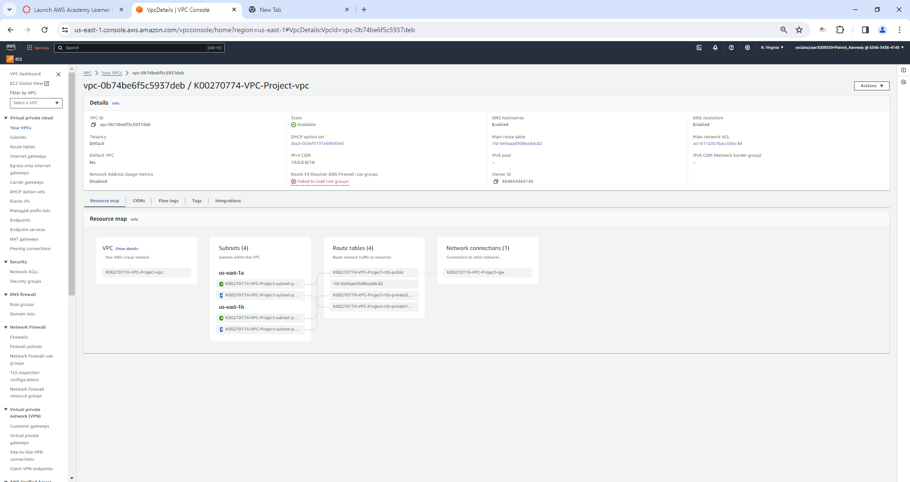
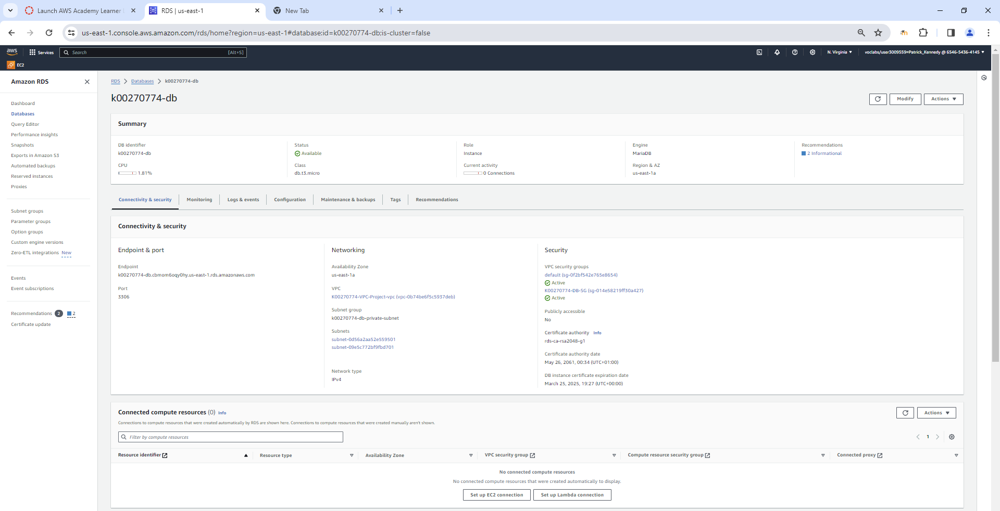

# AWS-VPC-Webserver-Database-AutoScaling

This repository contains the AWS Cloud Foundations Project, designed to demonstrate a complete two-tier architecture involving presentation and data storage layers using various AWS services. This project showcases an auto-scalable web server setup with a load balancer and a database service.

## Project Overview

The project is structured to provide a hands-on experience with AWS, focusing on building a scalable and robust web application infrastructure. Below are the main components:

- **Presentation Tier**: Utilizes Apache web servers running on Linux EC2 instances within an autoscaling group.
- **Data Storage Tier**: Managed by an RDS cluster featuring a primary and a secondary instance for high availability.

## Architecture Diagram

  
*This image provides a visual overview of the AWS resource deployment.*

## Setup and Configuration Steps

### 1. VPC Configuration

Here are the details of the Virtual Private Cloud configuration, illustrating how the VPC is structured.

### 2. Subnets

Details of the subnet configuration within the VPC are shown here.

### 3. EC2 Instances

Configuration and deployment of EC2 instances.

### 4. Security Groups

#### EC2 Security Groups

- Inbound Rules  
  
- Outbound Rules  
  

#### Database Security Groups

- Inbound Rules  
  
- Outbound Rules  
  

### 5. RDS - Relational Database Service

Configuration details and the setup of the RDS instance.

### 6. Load Balancer

Details of the load balancer configuration and its role in distributing traffic.

### 7. Target Group

Configuration of the target group which is used by the load balancer to route traffic to EC2 instances.

### 8. Auto Scaling

Setup and configuration details of the Auto Scaling group.

### 9. Main Webserver EC2

Detailed view of the main webserver EC2 instance.

### 10. Load Balancer DNS Connections

- DNS Connect Test (Load Test)  
  
- DNS Connect Test (RDS)  
  

### 11. AMI

Details of the Amazon Machine Image used for the web servers.

